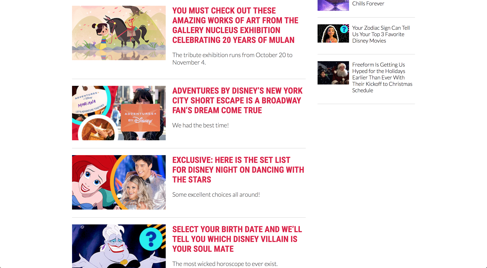

# SiteRebuild

#### Angular project for Epicodus independent code review, 10.19.18

#### By Nikki Wong

## Description

This application is a site rebuild of the Oh My Disney website.

## Live Site
https://ohmy.disney.com/

| Screenshot  | Description |
| ------------- | ------------- |
|   | Landing Page  |
|   | Footer  |
|   | News Page  |

## Planning
* Components:
  * Recent Posts
    * Required information for each post:
      * Headline
      * Subheadline
      * Image
      * URL
  * Popular Posts
    * Required information for each post:
      * Headline
      * Image
      * URL
  * Retail Posts
    * Required information for each post:
      * Headline
      * Shop Name
      * Image
      * Cost
      * URL
  * Secondary Popular Posts
    * Required information for each post:
      * Headline
      * Image
      * URL
  * Featured Posts
    * Required information for each post:
      * Headline
      * Image
      * URL
* Stretch goals:
  * Implementing multi-page functionality
  * Styling

## Clone Site

Live Site: https://site-rebuild-d795b.firebaseapp.com/

| Screenshot  | Description |
| ------------- | ------------- |
|   | Landing Page  |
|   | Recent Posts  |
|   | Footer  |
|   | News Page  |

## Specs

| Behavior | Example Input | Example Output |
|----------|-------|--------|
| On page load, the 24 most recent posts and 4 most popular posts are displayed | page load | 24 most recently published posts and 4 most popular posts |
| When user clicks on a post, the page for that post is displayed | user clicks on "ALL THE FOOD WE ATE AT THE EPCOT INTERNATIONAL FOOD & WINE FESTIVAL" | "ALL THE FOOD WE ATE AT THE EPCOT INTERNATIONAL FOOD & WINE FESTIVAL" post page is loaded |
| When user clicks a category link in the navigation bar, the corresponding page for that category displayed | user clicks on "NEWS" | News page |

## Features
* Completed
  * Recent, popular, feature, and retail posts are displayed to the user
  * User can click posts to view post page
  * Working database
  * Multi-page functionality/routing
* To Be Added
  * Filter posts by category
  * Deployed to Firebase
  * View next page of posts

## Setup on OSX

* Clone this repository
* Run `npm install`

## Development server

Run `ng serve` for a dev server. Navigate to `http://localhost:4200/`. The app will automatically reload if you change any of the source files.

## Code scaffolding

Run `ng generate component component-name` to generate a new component. You can also use `ng generate directive|pipe|service|class|guard|interface|enum|module`.

## Build

Run `ng build` to build the project. The build artifacts will be stored in the `dist/` directory. Use the `-prod` flag for a production build.

## Running unit tests

Run `ng test` to execute the unit tests via [Karma](https://karma-runner.github.io).

## Running end-to-end tests

Run `ng e2e` to execute the end-to-end tests via [Protractor](http://www.protractortest.org/).

## Further help

To get more help on the Angular CLI use `ng help` or go check out the [Angular CLI README](https://github.com/angular/angular-cli/blob/master/README.md).

## Technologies Used

This project was generated with [Angular CLI](https://github.com/angular/angular-cli) version 1.6.5.

* JavaScript
* Node.js
* Babel
* Webpack

## License

Copyright (c) 2018 **Nikki Wong**
